# Lab 1 – Using and customizing built-in analyzers

In this lab you will explore the out of the box capabilities of Visual
Studio for running and customizing code analyzers. In lab 2, you will
explore the capabilities that come with adding external analyzer
libraries and in lab 3 you’ll discover how to build your own diagnostic
with code fix.

Static Analysis tools have been around since VS2005 with an external
tool called FxCop. This tool analyzed compiled code rather than looking
at the actual source. Roslyn based tools on the other hand work with the
actual written source code and as a result are able to identify issues
with not only the compiled source, but also styling based items like
whitespace, comments, indentation, ordering, etc. Additionally, since
Roslyn is the same language service that the compiler uses. As a result,
whenever the language features are enhanced, you can start applying
analyzers against them.

## Enable running analysis on build

In order to follow along with this lab, open the project in the
Lab1-Start folder. Double click on the properties node of the project.
Select the Code Analysis tab and check on the option to “Enable Code
Analysis on Build.”

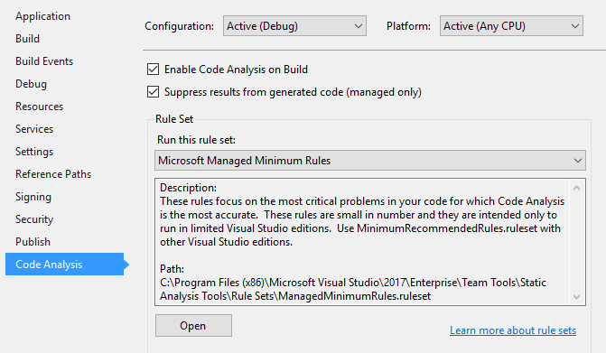

Build the project and open the Errors window. Here you will see a number
of errors, warnings and info messages. You can enable and disable any of
the severity levels by clicking the appropriate box.

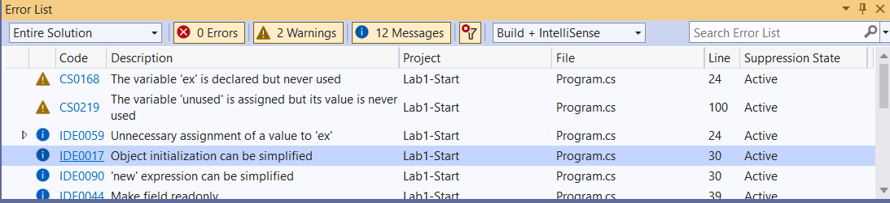

In many cases, you can double click on each issue to display the error
or click on the code Id to view a help link that often explains the
issue that was detected and identifies potential fixes. Double click on
the item for CS0105. Notice the lightbulb that appears in the code well
to the left of your code. Click on it to display the issue along with
potential fixes. Select the option to “Remove Unnecessary Usings” and
notice the resulting code shrink. Naturally removing usings doesn’t
impact the resulting compiled code, but it does reduce the amount of
code that you need to know that you can ignore when maintaining the code
over time.


Returning to the error listing, you should now see that the first item
is removed. Sometimes, particularly in large solutions, the error list
can become overwhelming. In these cases, it is often best to divide and
conquer. For example, you can now filter the error list by clicking the
right side of the column header to drop down a filter box and selecting
the items you want to focus on. This can be done on any column. Try this
out by filtering the id list removing CS0168. We will use a different
fix for that issue in the next lab, so let’s safely ignore this one for
now.


Let’s continue working through the list of issues by double clicking on
each

-   For CS0219 – Double click the error and delete the variable
    declaration since it’s no longer used.

-   For IDE0011 – Double click the error then press ctrl-. To raise the
    fix data tip and enter to apply the fix.

-   For CA1001 – Change Person to implement IDisposable as follows. (You
    will need to build the project once you’ve made this change to clear
    this error.)
```cs
public class Person : IDisposable

{

    public void Dispose()

    {

        ShouldBeDisposed.Dispose();

    }
```
At this point, all of the error messages should be cleared. However,
we’re not done yet. So far we’re only working with the minimal set of
code analysis rules. Let’s expand the set we are using to see what
additional fixes the tooling can recommend to improve our code quality.
Open the project properties again and select the “Code Analysis” tab.
Change the rule set to “Microsoft All Rules”.

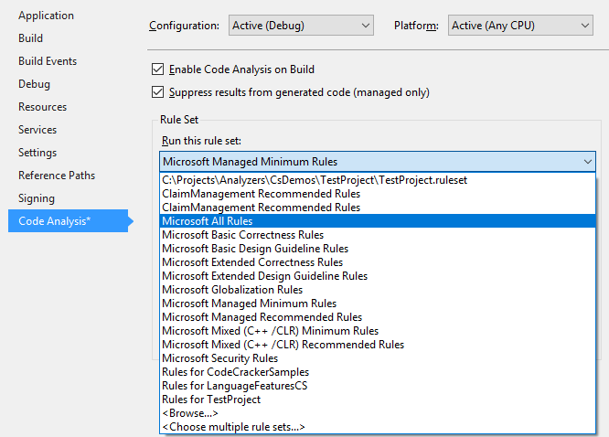

Recompile the solution and notice that our previously clean error
listing now has a number of new errors.

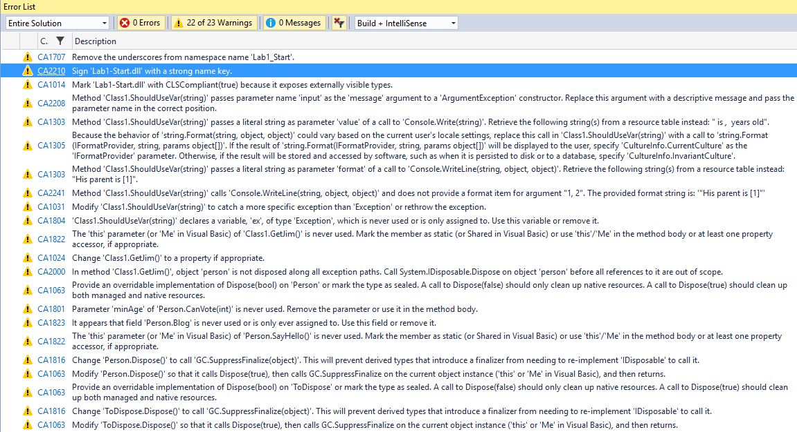

Many times, some of the rules don’t apply to our project needs or
conflict with internally agreed upon coding standards. Open the property
screen for Code Analysis again and click “Open” to edit the ruleset. For
our example, we won’t care if the assemblies have strong names, so we’ll
unselect CA2210. Also, since we’re not going to worry about
globalization with our application, we can safely remove CA1303 and
CA1305. If you prefer, instead of removing the rules, you can change the
severity. For example, you may care about making sure that your library
can be consumed by languages other than C# and thus may want to CA1014
an error instead of a warning to force developers to fix this issue in
order to compile the code.

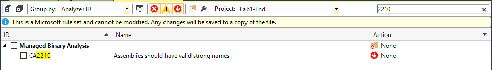

When you save your changes to the rules, because you have modified the
rules, Visual Studio creates a new {project}.ruleset file. The advantage
of this is you can check the ruleset into your repository and ensure
that all developers on your team abide by your agreed upon rules. You
can also decide down the road to add more rules so that you don’t feel
overwhelmed by the number of issues you may be confronted with when
adding analyzers to your project. It’s better to slowly incorporate
better practices into your code base than to give up on the tools
entirely prematurely.

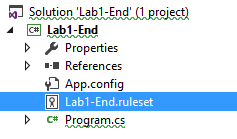

At this point, you should be able to have enough experience to work
through some of the common issues that were identified. Try working
through the error list and fix the following items: CA1014, CA1063,
CA1707, CA1801, CA1816, CA2000, CA2241. If you are unsure of how to
handle them, try clicking on the ruleset Id and read the help
documentation.

## Customizing Code Style

Visual Studio 2017 introduced a new feature that allows much greater
flexibility in terms of being able to customize the rules beyond just
turning them on and off. Open the dialog by selecting Tools -\> Options.
Search for Code Style. From here you can set your preference for a
number of commonly debated (often religiously so) coding style options.
For example, do you prefer “var” or explicit types? Do you prefer your
opening braces on a new line or at the end of the previous line? Let’s
test this by changing the ‘var’ preferences by setting them to prefer
var and set the severity to warning. If you’re not sure what the setting
would result in, check out the sample window under the settings.

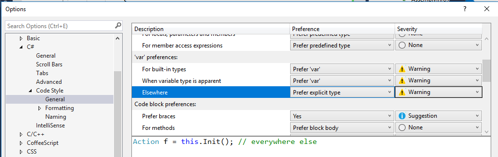

Apply your changes and try to modify the declaration on “Person person”
as shown below.. You should see warnings about IDE0007 recommending to
use var instead of the explicit type on Person person = new Person().
(At this point, changes to code style don’t necessarily trigger the
compiler to recheck your code. It might be necessary to close and open
the file to have the changes show up.) Open the light bulb to see the
recommended fix. Under the diffed code, notice options to fix all
occurences. Try clicking on the “Document” option to fix all of the
IDE0007 items in this current file.

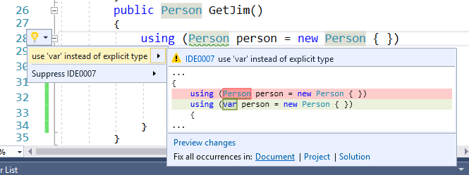

## Customizing Naming

The new code style options also allow you to customize naming
conventions. Various shops feel very passionate about their naming
choices. You now have a way of setting them so that tooling can detect
and recommend fixes for issues. Let’s try this out by creating a rule to
require constants to be named with all upper case characters. We’ll
ignore for the sake of example here whether such practice is a good idea
or not. Open Tools -\> Options and navigate to the Naming option under
Code Style.

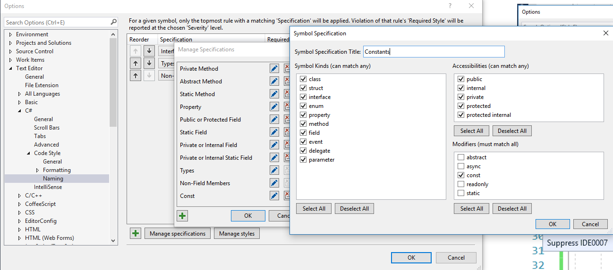

Before we can add the style, we need to add a specification that applies
to Constants. Click “Manage specifications” and then the “+” option to
add a specification. Select the “const” modifier and name the
specification’s Title.

Next, add a naming style by clicking “Manage styles”, then “+” to add a
style. Set the Naming Style Title and set the Capitalization option to
“ALL UPPER”. Ensure that the Sample Identifier value agrees with your
expected convention and click Ok to save this style.

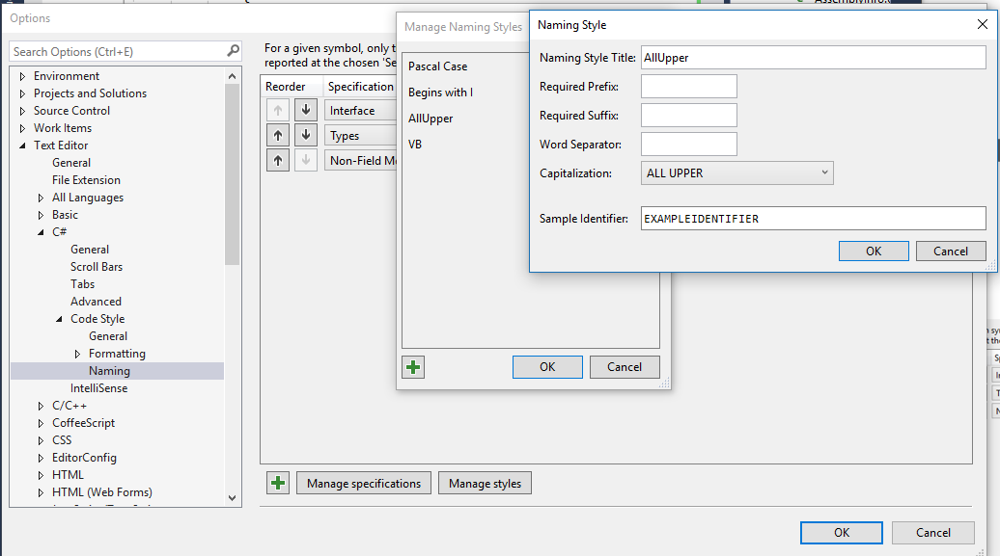

Next, we can add the naming style by clicking the “+” to add a style.
Set the Specification value to “Constants” that you created above and
the Required Style to “AllUpper”. Set the severity as appropriate and
save your changes by clicking “Ok”.

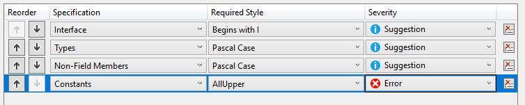

Test your changes out by adding a constant value in your code using a
different naming convention.


## On your own

At this point you should be ready to branch out on your own. Try opening
an existing project and apply what you’ve learned on using the existing
code analysis tools on your project.
