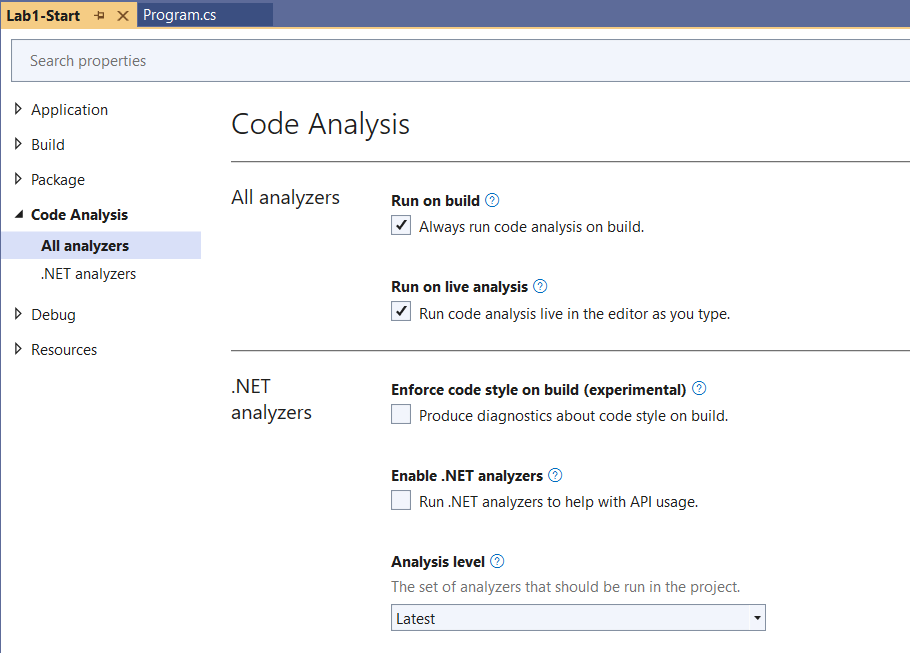

# Lab 1 – Using and customizing built-in analyzers

In this lab you will explore the out of the box capabilities of Visual
Studio for running and customizing code analyzers. In lab 2, you will
explore the capabilities that come with adding external analyzer
libraries and in lab 3 you’ll discover how to build your own diagnostic
with code fix.

Static Analysis tools have been around since VS2005 with an external
tool called FxCop. This tool analyzed compiled code rather than looking
at the actual source. Roslyn based tools on the other hand work with the
actual written source code and as a result are able to identify issues
with not only the compiled source, but also styling based items like
whitespace, comments, indentation, ordering, etc. Additionally, since
Roslyn is the same language service that the compiler uses. 
whenever the language features are enhanced, you can start applying
analyzers against them.

## Enable running analysis on build

In order to follow along with this lab, open the project in the
Lab1-Start folder. In earlier versions of Visual Studio, you had to explicitly enable code analysis, but this is automatically enabled now with Roslyn.



Build the project and open the Errors window. Here you will see a number
of errors, warnings and info messages. You can enable and disable any of
the severity levels by clicking the appropriate box. To get the full experience in this lab, make sure that the Errors, Warnings, and Info messages options are all selected.


The description for each of the issues is often self-explanitory, but in cases where you need additional clarification, you can double click on each issue to display the error
or click on the code Id to view a help link. This link often explains the
issue that was detected and identifies potential fixes. Double click on
the item for `CS0105`. Notice the lightbulb that appears in the code well
to the left of your code. Click on it to display the issue along with
potential fixes. Select the option to “Remove Unnecessary Usings” and
notice the resulting code shrink. Naturally removing usings doesn’t
impact the resulting compiled code, but it does reduce the amount of
code that you need to know that you can ignore when maintaining the code
over time.


Returning to the error listing, you should now see that the first item
is removed. Sometimes, particularly in large solutions, the error list
can become overwhelming. In these cases, it is often best to divide and
conquer. For example, you can now filter the error list by clicking the
right side of the column header to drop down a filter box and selecting
the items you want to focus on. This can be done on any column. Try this
out by filtering the id list removing CS0168. We will use a different
fix for that issue in the next lab, so let’s safely ignore this one for
now.


Another trick that is useful on particularly large code bases where the developers haven't been diligent about monitoring issues is to filter the errors window not by `Entire Solution`, but for `Current Document` or `Changed Documents`. In this case, you can clean up your code on segments you are actively working on, but leave the rest for later when you are modifying the other files.

Let’s continue working through the list of issues by double clicking on
each

-   For CS0219 – Double click the error and delete the variable
    declaration since it’s no longer used.
- Sometimes the same fix can apply to multiple instances of the same analyzer rule. Locate the issue for IDE0044 and select the light-bulb. From the Add Read-only Modifier suggested code fix, notice that the fix preview window shows options to apply the fix to the document, project and solution. Selecting `document` will prompt you with a preview window of the other places that the change could apply and you are able to select which locations you want to fix with appropriate previews. Clicking `Apply` will update all of the selected locations.
- Another helpful tool for applying multiple fixes is to use the Code Cleanup tool, which can be found by clicking the paintbrush at the bottom of the program.cs code window. This tool can be configured with multiple profiles and groups of rules to auto-apply on the current file. 
- For the other issues, try either selecting the light-bulb, or simply selecting the line in question and pressing `ctrl-.` to get a suggested fix. 

**
-   For IDE0011 – Double click the error then press ctrl-. To raise the
    fix data tip and enter to apply the fix.

-   For CA1001 – Change Person to implement IDisposable as follows. (You
    will need to build the project once you’ve made this change to clear
    this error.)
```cs
public class Person : IDisposable

{

    public void Dispose()

    {

        ShouldBeDisposed.Dispose();

    }
```
**
At this point, all of the error messages should be cleared. However,
we’re not done yet. So far we’re only working with the minimal set of
code analysis rules. Let’s expand the set we are using to see what
additional fixes the tooling can recommend to improve our code quality. 
Open the project properties window and select the “Code Analysis” tab. Under .NET analyzers, notice the setting for `Analysis level`. Changing this to `Latest All` and notice that our previously clean error listing now has a number of new errors.
 If you check the git changes, you will see that there is a change to your csproj file with the new setting. This value is only configured for this project and doesn't automatically apply to other files in your solution.

Many times, some of the rules don’t apply to our project needs or
conflict with internally agreed upon coding standards. Customizing the rules has moved from the property page to the solution explorer. Expand Dependencies -> Analyzers to see the full list of rules along with the severity icon associated with each.
From here, we can customize the severities. For
our example, we won’t care if the assemblies have strong names, so we’ll
unselect CA2210.
 Also, since we’re not going to worry about
globalization with our application, we can safely remove CA1303 and
CA1305. If you prefer, instead of removing the rules, you can change the
severity. For example, you may care about making sure that your library
can be consumed by languages other than C# and thus may want to CA1014
an error instead of a warning to force developers to fix this issue in
order to compile the code.

When you apply the changes to your rules, a new `.editorconfig` file is added to your project. This replaces the old `ruleset` files and is helpful because it is included in your source repository for use by all of your developers. Additionally, it can be used to specify lots of rules that multiple IDEs (not just Visual Studio) can observe. It also can cascade. If you move this file to the solution root, it will apply to all projects in the solution. A second `.editorconfig` file in the project will then override settings from the solution one, which is helpful in cases where the UI and Services tiers may have different expectations from a coding standard perspective.

By establishing a base set of rules on your solution, you can ensure
that all developers on your team abide by your agreed upon rules. You
can also decide down the road to add more rules so that you don’t feel
overwhelmed by the number of issues you may be confronted with when
adding analyzers to your project. It’s better to slowly incorporate
better practices into your code base than to give up on the tools
entirely prematurely.

At this point, you should be able to have enough experience to work
through some of the common issues that were identified. Try working
through the error list and fix the remaining items. If you are unsure of how to
handle them, try clicking on the code and read the help
documentation.

## Customizing Code Style

Visual Studio 2017 introduced a new feature that allows much greater
flexibility in terms of being able to customize the rules beyond just
turning them on and off. Originally, this only applied to your developer session and any that roamed with your profile, but were not shared by the rest of the team. Now that we have an .editorconfig file, we can open it in VS 2022 and edit the shared rules there.

For example, do you prefer “var” or explicit types? Do you prefer your
opening braces on a new line or at the end of the previous line? Let’s
test this by changing the ‘var’ preferences by setting them to prefer
var and set the severity to warning. If you’re not sure what the setting
would result in, check out the sample window under the settings.


Apply your changes and try to modify the declaration on “Person person”
as shown below.. You should see warnings about `IDE0007` recommending to
use var instead of the explicit type on `Person person = new Person()`.
(Sometimes, changes to code style don’t necessarily trigger the
compiler to recheck your code. It might be necessary to close and open
the file to have the changes show up.) Open the light bulb to see the
recommended fix. Under the diffed code, notice options to fix all
occurrences. Try clicking on the “Document” option to fix all of the
`IDE0007` items in this current file.

## Customizing Naming

The new code style options also allow you to customize naming
conventions. Various shops feel very passionate about their naming
choices. One of the three most difficult things in programming is naming. (The other one is off-by-one errors.) You now have a way of setting them so that tooling can detect
and recommend fixes for issues. Let’s try this out by creating a rule to
require constants to use the old-school standard of all upper case characters. We’ll
ignore for the sake of example here whether such practice is a good idea
or not. 

There is an editor for naming styles, but it does not update the editorconfig. To manage naming styles in editorconfig, right-click on the `.editorconfig` file and select `Open With` then `Source Code (Text) editor`. You'll see that this file is just a text file with key value sets. In this file, we need to set three sets of values: 
- dotnet_naming_rule
- dotnet_naming_symbols
- dotnet_naming_style

For the dotnet_naming_symbols, we'll specify that the rule will apply to symbols with the `const` modifier:
```dotnet_naming_symbols.constants.applicable_kinds = namespace, property, field, event, parameter, local, class, struct, interface, enum, delegate, method, local_function
dotnet_naming_symbols.constants.applicable_accessibilities = *
dotnet_naming_symbols.constants.required_modifiers = const
```
for the naming style, we'll indicate that we want the capitalization to be `all_upper`
```dotnet_naming_style.all_upper.required_prefix = 
dotnet_naming_style.all_upper.required_suffix = 
dotnet_naming_style.all_upper.word_separator = _
dotnet_naming_style.all_upper.capitalization = all_upper
```
Finally, we'll wire together the naming_symbols with the naming_styles. Notice here that we pick up the definition name dynamically from the dotted syntax in the previous declarations:

```
dotnet_naming_rule.constants_should_be_all_upper.severity = warning
dotnet_naming_rule.constants_should_be_all_upper.symbols = constants
dotnet_naming_rule.constants_should_be_all_upper.style = all_upper
```

Test your changes out by adding a constant value in your code using a
different naming convention.


For more information on managing the Naming styles in editorconfig, see the [online docs](https://docs.microsoft.com/en-us/dotnet/fundamentals/code-analysis/style-rules/naming-rules).

## On your own

At this point you should be ready to branch out on your own. Try opening
an existing project and apply what you’ve learned on using the existing
code analysis tools on your project.
