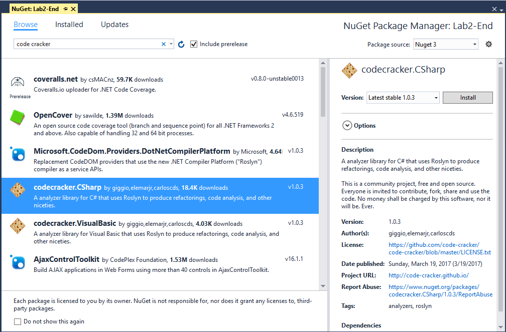
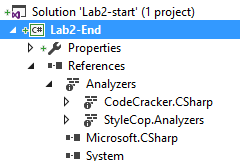
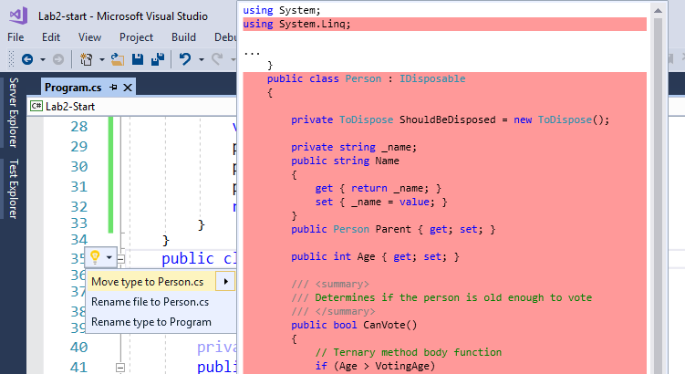

# Lab 2 – Adding external analyzers

In this lab, we’re going to continue improving the code file that we
started in Lab1. This time, we’re going to add a couple open source
analyzer packages and see what additional improvements they can
recommend for our code. Begin by opening the Lab2-Start.project file.

Right click on the project and select “Manage NuGet Packages”. Click on
the Browse tab and search for “Code-cracker”. Locate the
codecracker.CSharp package and install it. 

Do the same for the
StyleCop.Analyzers package. Note that the SyleCop can be a bit picky at times, particularly around white-space aod doesn't have as many code-fixes, so you will need to manually fix many of the findings from this package.

If
you expand the references tab of your project, you should see a folder
for “Analyzers” and under that entries for CodeCracker.CSharp and
StyleCop.Analyzers. Analyzers need to be installed on each project that
you wish to use them on. This allows for easy deployment via the NuGet
package manager. It also allows library authors to ship analyzers with
their libraries when domain specific or best-practice issues are known.

Even without building your project, you should notice that Visual Studio
is now reporting quite a number of new errors, warnings, and info
messages. Use the table below to guide you through locating the various
issues and applying the appropriate code fixes for this lab. In many
cases, the option you choose may be subject to your preferred coding
standards, but if you select different fixes than recommended here, the
subsequent fixes may not light up as some fixes are dependent on
applying the previous fix.

To illustrate the first row of the table, find the file Class1 on the
“Person” string of the “Person class” to apply the fix “Move type to new
file”, you should see the following in Visual Studio. Applying the
fix will apply the best practice rule of limiting each file to a single
class and generates a new Person.cs file.

There are quite a few code fixes for this lab. See how many of them you can apply. Monitor the Errors window and check for any code that has squiggles or suggestions (three dots under the code). When in doubt, check the help link.

In some cases, rules from different analyzers may conflict. You may want to tweak the `.editorconfig` rules from lab1 to reconcile which one you want. Set the conflicting rule to `None` to disable it.

When in doubt, compare your solutions against the version in the lab2-end folder for sample fixes and refactorings.

## On your own

Try working through the rest of the errors, warnings and info messages
and see if you can either clean up all of the remaining issues, or
suppress/disable those that you don’t feel are necessary for your
application/agency.
