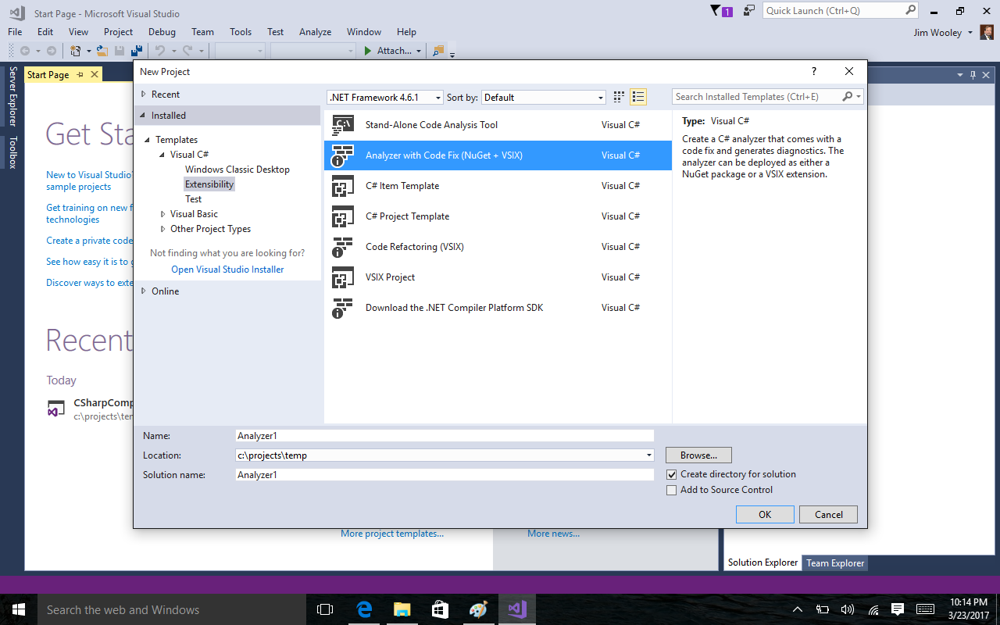
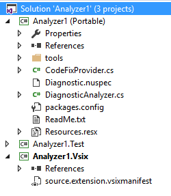

# Lab - Creating a Diagnostic with Code Fix

In this lab, we will create a diagnostic with code fix to detect and
correct a domain specific error. Consider the following code sample for
a MVC controller class:

``` cs
public class TestControllerMisnamed : Controller
{
    public TestControllerMisnamed()
    {

    }

    // GET: Test
    public ActionResult Index()
    {
        return View();
    }
}
```

This code compiles fine, but poses a hidden bug that could cause plenty
of headache at runtime . If you look closer, you’ll notice that the
class is misnamed. MVC uses a convention based approach where the
controller class’s name must end in the word “Controller” otherwise, the
routing engine will not locate the controller at runtime and result in a
HTTP 404 – Not Found exception when attempting to navigate to the route.
To avoid this, we’ll build a Roslyn diagnostic with code fix to detect
the error and offer a resolution to the issue.

## Install Visual Studio 2017 with the Roslyn SDK

To get started, we need to ensure the SDK and tools are installed. If
you are using Visual Studio 2017, open the installer and select the
Visual Studio extension development workload. This will install the
libraries and Syntax Visualizer tool that we will use later.


Now that you have the tools, you will need to download and install the
Visual Studio templates from
<https://go.microsoft.com/fwlink/?LinkID=526901>.

If you are using Visual Studio 2015, you can find the instructions to
install the Visual Studio SDK at
<https://msdn.microsoft.com/en-us/library/mt683786.aspx>.

## Creating the project

With the SDK installed, it’s time to create your first analyzer. From
File -\> New Project, select the Extensibility templates and locate the
“Analyzer with Code Fix (NuGet + VSIX)” template. Name the project or
just take the defaults and click Ok.



The template creates a
solution with three projects:

-   Analyze1r – This is the main analyzer library and contains the core
    logic for the tool.

-   Analyzer1.Test – This is a unit test project. Unit tests are the
    best way to test and debug your analyzer. We’ll use this later in
    the lab.

-   Analyzer1.Vsix – This is a Visual Studio extension project. It will
    only be used if you F5 debug your application. It is not used for
    typical deployments unless you create Code Refactoring packages.
    (Many refactorings are actually done by setting the analyzer’s
    severity level to None and simplifies the deployment mechanism to
    just NuGet packges.)

## Implementing the Analyzer

Let’s start implementing our analyzer. From the solution explorer, open
the DiagnosticAnalyzer. Start by changing the DiagnosticIId constant to
a value that you will use to recognize it in the ruleset editor. This is
typically an abbreviated name of the analyzer tool and a unique number
within that tool. In our case, change this to INDY0001:

```cs
public const string DiagnosticId = "Indy0001";
```

Next, we need to modify the configuration information that we’ll use to
register our fix with Visual Studio. This will include a title,
description, message, category and default severity. The default
template from the SDK that we created this project from uses a resource
file to manage these values and stores them in a resource file so that
it can be easily globalized. Open the Resources.resx file and update
these as follows:


Returning to the DiagnosticAnalyzer.cs file, let’s adjust the Rule that
we will use to register with Visual Studio for our fix. Since the
diagnostic that we’re creating detects issues that will cause errors at
runtime, let’s adjust the default severity on our rule to
DiagnosticSeverity.Error as follows:

```cs
private static DiagnosticDescriptor Rule = 

    new DiagnosticDescriptor(DiagnosticId, Title, MessageFormat, 
        Category, DiagnosticSeverity.Error, 
        isEnabledByDefault: true, 
        description: Description);
```

We can leave the rest of the configuration section alone and just stay
with the values set in the template. Now we can turn our attention to
the implementation code.

Our implementation starts with the Initialize method. Here we indicate
the type of code that we want to detect and when to detect it. In the
Initialize method. Place a dot after context to explore the actions you
can register. They are:

-   RegisterCodeBlockAction
-   RegisterCodeBlockStartAction
-   RegisterCompilationAction
-   RegisterCompilationStartAction
-   RegisterSemanticModelAction
-   RegisterSymbolAction
-   RegisterSyntaxNodeAction
-   RegisterSyntaxTreeAction

As a general guide, we need to use the least invasive and performance
intensive option in order to keep our analyzer from needlessly hogging
resources. In our case, we only need to evaluate our rule if the class
name or its base class changes. As a result, we can just use the
RegisterSymbolAction.

Next, we need to identify the kind of symbol that we want to watch. If
you check the intellisense on SymbolKind, you’ll find the following enum
values:

-   Alias
-   ArrayType
-   Assembly
-   DynamicType
-   ErrorType
-   Event
-   Field
-   Label
-   Local
-   Method
-   NetModule
-   NamedType
-   Namespace
-   Parameter
-   PointerType
-   Property
-   RangeVariable
-   TypeParameter
-   Preprocessing

In the case of a class, we’re dealing with a `NamedType`. As a result,
we’re just going to leave the Initialize implementation alone and use
the value from the template:

```cs
context.RegisterSymbolAction(AnalyzeSymbol, SymbolKind.NamedType);
```
    

The only thing remaining to our diagnostic is to implement the actual
logic to detect if there is a potential error. Change the Analyzer
implementation to the following:

```cs
private void AnalyzeSymbol(SymbolAnalysisContext context)

{

    var symbol = (INamedTypeSymbol)context.Symbol;

    if (symbol.BaseType == null) return;

    if ((symbol.BaseType.Name == "Controller" 

|| symbol.BaseType.Name == "ApiController") &&

        !symbol.Name.EndsWith("Controller"))

    {

        var diagnostic = Diagnostic.Create(Rule, 

symbol.Locations\[0\], symbol.Name);

        context.ReportDiagnostic(diagnostic);

    }

}
```

In this code, we start by casting the context’s `Symbol` as an
`INamedTypeSymbol`. We should be safe here because when we registered the
rule, we told Roslyn to only let our analyzer know about Named Type
symbols. Next, we check to see if our class derives from any other
types. If it doesn’t, there’s no reason to evaluate any other
conditions. Roslyn best practices dictate that we exit out of the
process as soon as we can to increase performance.

If we do have a base class, we’ll check to see if that class name is
Controller or ApiController and if so, see if our class’s name ends in
the word Controller. If not, then we will create the diagnostic for our
rule indicating the location of the symbol and name. The name will be
concatenated into the MessageFormat that we specified in the resource
file. The location will indicate which parts of the code will be
identified as an error in the IDE. We then call context.ReportDiagnostic
with the one we created which is what causes Visual Studio to show the
diagnostic to the user.

At this point, we’re done with this diagnostic. We could end here and
force the user to manually fix their code, but in our case we know that
there is a relatively simple fix, to change the name to end in
“Controller”, so let’s continue by adding the CodeFix for our
diagnostic.

## Implementing the CodeFix

In the Analyzer project, open the CodeFixProvider.cs file from the
template. We’ll update this code to implement our fix. The beginning of
the CodeFixProvider primarily consists of boiler plate. We’ll just
change the title constant to be more appropriate to our tool.
```cs
private const string title = "Ensure type ends in 'Controller'"
```
The meat of our work is in the RegisterCodeFixesAsync method and in the
actual fixer method. Delete the template’s MakeUppercaseAsync method and
replace it with the following method that performs the fix:
```cs
private async Task\<Document\> MakeEndInControllerAsync(

Document document, 

TypeDeclarationSyntax typeDecl, 

CancellationToken cancellationToken)

{

    var identifierToken = typeDecl.Identifier;

    var originalName = identifierToken.Text;

    var nameWithoutController = 

Regex.Replace(originalName, "controller", String.Empty, 

RegexOptions.IgnoreCase);

    var newName = nameWithoutController + "Controller";

    var semanticModel = 

await document.GetSemanticModelAsync(cancellationToken);

    var typeSymbol = 

semanticModel.GetDeclaredSymbol(typeDecl, cancellationToken);

    var root = await document.GetSyntaxRootAsync(cancellationToken);

    var newIdentifier = SyntaxFactory.Identifier(newName)

        .WithAdditionalAnnotations(Formatter.Annotation);

    var newDeclaration = 

typeDecl.ReplaceToken(identifierToken, newIdentifier);

    var newRoot = root.ReplaceNode(typeDecl, newDeclaration);

    return document

        .WithSyntaxRoot(newRoot);

          

}
```

Add the following using clauses to the top of your code file.

```cs
using System.Text.RegularExpressions;

using Microsoft.CodeAnalysis.Formatting;
```

Because we have a new fix method, we need to update the code that
registers the fix in the RegisterCodeFixesAsync method. The last line
should be changed to:

```cs
context.RegisterCodeFix(CodeAction.Create(title, 

c =\> MakeEndInControllerAsync(context.Document, declaration, c)), diagnostic);
```
## Debugging the change

At this point, the code should be ready to test. Press F5 to debug the
application. This will launch a second “Experimental” version of Visual
Studio. Realize that VS can’t debug the extension if it is installed in
its own workspace, thus we need to create a new workspace to test
against. When the new instance opens, create a new MVC web site. Open
the HomeController and rename it to HomeControllerMisnamed. If all goes
well, you should see the class name underlined with a code lightbulb
identifying the issue that your analyzer identified. You can always put
a breakpoint in your AnalyzeSymbol method to interrogate the various
objects from your test code base.

Expanding
the potential code fixes, you should be presented with a diff between
the current value and the revised fix that you wrote.


## Adding tests

As you may have noticed when testing the change inside Visual Studio, it
takes a while to spin up Visual Studio and test interactively. The
better alternative is to create coded unit tests that exercises input
code snippets and asserts that the analyzer detects positive and
negative scenarios and can fix the code based on your fix logic. Open
the unittests.cs file in the .Test project. Replace the test method with
the following test (don’t replace the overrides for
GetCSharpCodeFixProvider or GetCSharpDiagnosticAnalyzer):

```cs
[TestMethod]

public void MvcClassWithoutConstructorFixes()

{

    var test = @"

using System.Web.Mvc;

namespace WebApplicationCS.Controllers

{

    public class HomeControllerTest : Controller

    {

        public ActionResult Index()

        {

            return View();

        }

    }

}";

    var expected = new DiagnosticResult

    {

        Id = "Indy0001",

        Message = String.Format("Type name '{0}' does not end in Controller", "HomeControllerTest"),

        Severity = DiagnosticSeverity.Error,

        Locations =

            new\[\] {

                   new DiagnosticResultLocation("Test0.cs", 6, 18)

                }

    };

    VerifyCSharpDiagnostic(test, expected);

    var fixtest = @"

using System.Web.Mvc;

namespace WebApplicationCS.Controllers

{

    public class HomeTestController : Controller

    {

        public ActionResult Index()

        {

            return View();

        }

    }

}";

    VerifyCSharpFix(test, fixtest);

}
```

Run the test and see that it passes. If it indicates errors, try
debugging the test. Now, isn’t this a quicker option? Try adding another
test to check cases where the class derives from ApiController as well
as Controller. You should also be able to write tests to make sure that
if the class name does end in “Controller” that the analyzer does not
fire. Also ensure that the analyzer doesn’t fire if the class doesn’t
inherit from Controler.

Before we declare this done, let’s try to make one change to our test.
Add a constructor to both the test and fixtest strings as follows and
run the new test:

```cs
//Diagnostic and CodeFix both triggered and checked for

\[TestMethod\]

public void MvcClassNotEndingInControllerCreatesDiagnostics()

{

    var test = @"

using System.Web.Mvc;

namespace WebApplicationCS.Controllers

{

    public class HomeControllerTest : Controller

    {

public HomeControllerTest()

{

}

        public ActionResult Index()

        {

            return View();

        }

    }

}";

    var expected = new DiagnosticResult

    {

        Id = ControllerNamingConventionAnalyzer.DiagnosticId,

        Message = String.Format("Type name '{0}' does not end in Controller", "HomeControllerTest"),

        Severity = DiagnosticSeverity.Warning,

        Locations =

            new\[\] {

                    new DiagnosticResultLocation("Test0.cs", 6, 18)

                }

    };

   VerifyCSharpDiagnostic(test, expected);

    var fixtest = @"

using System.Web.Mvc;

namespace WebApplicationCS.Controllers

{

    public class HomeTestController : Controller

    {

public HomeTestController()

{

}

        public ActionResult Index()

        {

            return View();

        }

    }

}";

    VerifyCSharpFix(test, fixtest);

}
```
Oops, it appears that this test fails. Take a look back at your fix
code. Notice that it handled changing the name of the class, but didn’t
fix any references to that new class name, including the
self-referencing constructor. Let’s make a small change to our fix code
to leverage a Roslyn helper method. Update it to the following:
```cs
private async Task\<Solution\> MakeEndInControllerAsync(

Document document, 

TypeDeclarationSyntax typeDecl, 

CancellationToken cancellationToken)

{

    var identifierToken = typeDecl.Identifier;

    var originalName = identifierToken.Text;

    var nameWithoutController = 

Regex.Replace(originalName, "controller", String.Empty, 

RegexOptions.IgnoreCase);

    var newName = nameWithoutController + "Controller";

    var semanticModel = 

await document.GetSemanticModelAsync(cancellationToken);

    var typeSymbol = 

semanticModel.GetDeclaredSymbol(typeDecl, cancellationToken);

    var originalSolution = document.Project.Solution;

    var optionSet = originalSolution.Workspace.Options;

    var newSolution = 

await Renamer.RenameSymbolAsync(originalSolution, typeSymbol,

newName, optionSet, cancellationToken)

.ConfigureAwait(false);

    return newSolution;

}
```
Re-run your test and it should now pass.

## Additional challenge

Now that you have finished this test, you’re ready to try your hand at
some more challenges. For example, the current test doesn’t handle cases
where the class derives from a controller method in another namespace.
Also, it doesn’t work if you use a custom BaseController which derives
from Controller. Try updating the analyzer to be able to test for these
scenarios.
