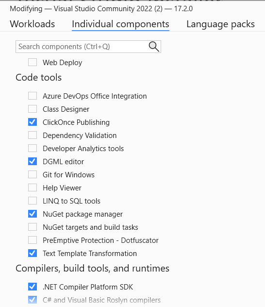

# Lab - Creating a Diagnostic with Code Fix

In this lab, we will create a diagnostic with code fix to detect and
correct a domain specific error. Consider the following code sample for
a MVC controller class:

``` cs
public class TestControllerMisnamed : Controller
{
    public TestControllerMisnamed()
    {

    }

    // GET: Test
    public ActionResult Index()
    {
        return View();
    }
}
```

This code compiles fine, but poses a hidden bug that could cause plenty
of headache at runtime. If you look closer, you’ll notice that the
class is misnamed. The .Net Framework version of MVC uses a convention based approach where the
controller class’s name must end in the word “Controller” otherwise, the
routing engine will not locate the controller at runtime and result in a
HTTP 404 – Not Found exception when attempting to navigate to the route.
To avoid this, we’ll build a Roslyn diagnostic with code fix to detect
the error and offer a resolution to the issue.

## Install Visual Studio with the Roslyn SDK

To get started, we need to ensure the SDK and tools are installed. If
you are using Visual Studio 2022, open the installer and select the
Visual Studio extension development workload. This will install the
libraries and Syntax Visualizer tool that we will use later.


If you want to use the directed graph feature of the visualizer to graphically see the syntax tree, also go into the `Individual Components` tab and select the `.Net Compiler Platform SDK` and `DGML Editor` options. 


## Exploring code with the Syntax Visualizer
Before we start manipulating code, we need to understand the structure of the code a bit more. If you built your own compiler, you would need to build a lexer and parser to understand the various pieces of the text files that represent code concepts in a specific language. One of the major benefits that Roslyn brings is that it has already done the heavy lifting of code understanding for C# and VB code. When you installed the .Net Compiler Platform SDK, you added a tool to view the code structure called the "Syntax Visualizer". Let's take a couple minutes exploring this tool that lets us peek into the syntax trees that the compiler understands, and that we will need to understand in order to explore code and re-write it for the analyzers and code fixes.

Open the WebApplication1 project in the Lab3-End folder. From there open the HomeController that we will be checking and fixing later in this lab. Once the controller is open, from the Visual Studio top menu, select `View` -> `Other Windows` -> `Syntax Visualizer`.

I often find it helpful to dock this along with the solution explorer to allow us to click on code and see the related tree easily. In the controller code window, click on the class name `HomeControllerMisnamed`. Notice that the Syntax Visualizer navigates and highlights the IdentifierToken for the class name.

Now click on the `Class Declaration` node in the syntax tree. Notice that the entire class is now highlighted in the code window. Try clicking around more in the code and visualizer tree and see how the two views interact.

If you installed the DGML Editor tool in Visual Studio, you should have access to a more graphical representation of the syntax tree. Let's test this out by right clicking on the ConstructorDeclaration node and selecting `View Directed Syntax Graph`.

In both the tree and graph, we can see a number of node types broadly categorized as:
- Syntax Node - Parsed language concepts and types. These can be nested.
- Token - Character values for the node
- Trivia Node - including comments, whitespace, End of line, etc. Technically, the compiler doesn't need to deal with the trivia, but when we are building code fixes, the trivia need to be observed and maintained in order for your developers not to complain about your tools removing their painstakingly constructed comments and whitespace alignments.

Let's check one more thing in the Syntax Visualizer. Once again, right click on the `Class Definition` node in the tree. This time, select the option to `View Symbol (if any)`

Notice in the property window below the `Kind` is `NamedType`. While this may not be very meaningful now, it will soon be crucial when we start to create the Analyzer for our feature. Let's stop just looking at code and start to put this information into action. 

## Creating the Analyzer with Code Fix

With the SDK installed, it’s time to create your first analyzer. Launch Visual Studio and select `Create a new project`. Search for `Roslyn` to find the installed templates for `Stand alone analyzer` and `Analyzer with code fix`.

 Since we want to build a tool for developers to get feedback while they are writing their code and offer a suggested fix, select the `Analyzer with code fix (.NET Standard)` option. NOTE: This is not a .Net 6 project. Visual Studio is built on .Net Framework and still depends on the older project types in the runtime.
 Name the project or
just take the defaults and click Ok.
The template creates a
solution with four projects:

-   Analyzer1 – This is the main analyzer library and contains the core
    logic for the tool.
    - Analyzer1.CodeFixes - This contains the Code fixes that apply to the analyzers above. These two projects can be combined if you want to manage the analyzers and fixes as a single deployable package.
    - Analyzer1.Package - Contains the scripts needed when building and deploying the package to nuget. We can ignore this for now.

-   Analyzer1.Test – This is a unit test project. Unit tests are the
    best way to test and debug your analyzer. We’ll use this later in
    the lab.

-   Analyzer1.Vsix – This is a Visual Studio extension project. It will
    only be used if you F5 debug your application. It is not used for
    typical deployments unless you create Code Refactoring packages.
    (Many refactorings are actually done by setting the analyzer’s
    severity level to None and simplifies the deployment mechanism to
    just NuGet packages.)


## Implementing the Analyzer

Let’s start implementing our analyzer. From the solution explorer, open
the Analyzer1's `Analyzer1Analyzer.cs` file. Start by changing the DiagnosticIId constant to
a value that you will use to recognize it in the `.editorconfig` and to associate the analyzer with applicable code fixes. This is
typically an abbreviated name of the analyzer tool and a unique number
within that tool. In our case, change this to `LAB0001`:

```cs
public const string DiagnosticId = "LAB0001";
```

Next, we need to modify the configuration information that we’ll use to
register our fix with Visual Studio. This will include a title,
description, message, category and default severity. The default
template from the SDK that we created this project from uses a resource
file to manage these values and stores them in a resource file so that
it can be easily globalized. Open the `Resources.resx` file and update
these as follows:


Returning to the `Analyzer1Analyzer.cs` file, let’s adjust the Rule that
we will use to register with Visual Studio for our fix. Since the
diagnostic that we’re creating detects issues that will cause errors at
runtime, let’s adjust the default severity on our rule to
DiagnosticSeverity.Error as follows:

```cs
private static readonly DiagnosticDescriptor Rule = 
    new DiagnosticDescriptor(
        DiagnosticId, 
        Title, 
        MessageFormat, 
        Category, 
        DiagnosticSeverity.Error, 
        isEnabledByDefault: true, 
        description: Description);

```

We can leave the rest of the configuration section alone and just stay
with the values set in the template. Now we can turn our attention to
the implementation code.

The sample template uses a ridiculous rule trying to force all class names to all upper case. They use a crazy rule here to make sure that developers don't keep it in their deployed code. Our implementation starts with the Initialize method. Here we indicate
the type of code that we want to detect and when to detect it. In the
Initialize method. Place a dot after context to explore the actions you
can register. They are:

-   RegisterCodeBlockAction
-   RegisterCodeBlockStartAction
-   RegisterCompilationAction
-   RegisterCompilationStartAction
-   RegisterSemanticModelAction
-   RegisterSymbolAction
-   RegisterSyntaxNodeAction
-   RegisterSyntaxTreeAction

As a general guide, we need to use the least invasive and performance
intensive option in order to keep our analyzer from needlessly hogging
resources. In our case, we only need to evaluate our rule if the class
name or its base class changes. When we were looking at the syntax tree with the syntax visualizer, we found that we can identify the class definition as a Symbol. As a result, we can just use the
RegisterSymbolAction.

Next, we need to identify the kind of symbol that we want to watch. If
you check the intellisense on SymbolKind, you’ll find the following enum
values:

-   Alias
-   ArrayType
-   Assembly
-   DynamicType
-   ErrorType
-   Event
-   Field
-   Label
-   Local
-   Method
-   NetModule
-   NamedType
-   Namespace
-   Parameter
-   PointerType
-   Property
-   RangeVariable
-   TypeParameter
-   Preprocessing

Remember from the `Syntax Visualizer` tool we recognized that the class definition was a `SymbolKind` of `NamedType`. As a result,
we’re just going to leave the Initialize implementation alone and use
the value from the template:

```cs
context.RegisterSymbolAction(AnalyzeSymbol, SymbolKind.NamedType);
```
    

The only thing remaining to our diagnostic is to implement the actual
logic to detect if there is a potential error. Change the Analyzer
implementation to the following:

```cs
private static void AnalyzeSymbol(SymbolAnalysisContext context)
{
    if (context.Symbol is INamedTypeSymbol symbol)
    {
        if (symbol.BaseType == null) return;
        if ((symbol.BaseType.Name == "Controller"
                || symbol.BaseType.Name == "ApiController")
            && !symbol.Name.EndsWith("Controller"))
        {
            var diagnostic = Diagnostic.Create(Rule,
            symbol.Locations[0], symbol.Name);
            context.ReportDiagnostic(diagnostic);
        }
    }
}
```

In this code, we use pattern matching to test and cast the context’s `Symbol` to an
`INamedTypeSymbol`. We should be safe here because when we registered the
rule, we told Roslyn to only let our analyzer know about Named Type
symbols. Next, we check to see if our class derives from any other
types. If it doesn’t, there’s no reason to evaluate any other
conditions. Roslyn best practices dictate that we exit out of the
process as soon as we can to avoid unnecessary cycles and allocations to increase performance.

If we do have a base class, we’ll check to see if that class name is
Controller or ApiController and if so, see if our class’s name ends in
the word Controller. If not, then we will create the diagnostic for our
rule indicating the location of the symbol and name. The name will be
concatenated into the MessageFormat that we specified in the resource
file. The location will indicate which parts of the code will be
identified as an error in the IDE. We then call context.ReportDiagnostic
with the one we created which is what causes Visual Studio to show the
diagnostic to the user.

At this point, we’re done with this diagnostic. We could end here and
force the user to manually fix their code, but in our case we know that
there is a relatively simple fix, to change the name to end in
“Controller”, so let’s continue by adding the CodeFix for our
diagnostic.

## Implementing the CodeFix

In the `Analyzer1.CodeFixes` project, open the `Analyzer1CodeFixProvider.cs` file from the
template. We’ll update this code to implement our fix. The beginning of
the CodeFixProvider primarily consists of boiler- plate code. We’ll just
change the title constant to be more appropriate to our tool.in the `CodeFixResources.resx` file, update the CodeFixTitle's value to be `Ensure type ends in 'Controller'.`

The meat of our work is in the RegisterCodeFixesAsync method and in the
actual fixer method. Delete the template’s MakeUppercaseAsync method and
replace it with the following method that performs the fix:
```cs
private static async Task<Document> MakeEndInControllerAsync(
    Document document,
    TypeDeclarationSyntax typeDecl,
    CancellationToken cancellationToken)
{
    var identifierToken = typeDecl.Identifier;
    var originalName = identifierToken.Text;
    var nameWithoutController =
        Regex.Replace(originalName, "controller", String.Empty,
        RegexOptions.IgnoreCase);

    var newName = nameWithoutController + "Controller";
    var root = await document.GetSyntaxRootAsync(cancellationToken);

    var newIdentifier = SyntaxFactory.Identifier(newName)
        .WithAdditionalAnnotations(Formatter.Annotation);
    var newDeclaration =
        typeDecl.ReplaceToken(identifierToken, newIdentifier);
    var newRoot = root.ReplaceNode(typeDecl, newDeclaration);

    return document
        .WithSyntaxRoot(newRoot);
}
```

Add the following using clauses to the top of your code file.

```cs
using System.Text.RegularExpressions;

using Microsoft.CodeAnalysis.Formatting;
```

Because we have a new fix method, we need to update the code that
registers the fix in the RegisterCodeFixesAsync method. The last line
should be changed to:

```cs
context.RegisterCodeFix(
    CodeAction.Create(
        title: CodeFixResources.CodeFixTitle, 
        createChangedDocument: c=> MakeEndInControllerAsync(context.Document, declaration, c),
        equivalenceKey: nameof(CodeFixResources.CodeFixTitle)),
    diagnostic);
```
## Debugging the change

At this point, the code should be ready to test. Press F5 to debug the
application. This will launch a second “Experimental” version of Visual
Studio. Realize that VS can’t debug the extension if it is installed in
its own workspace, thus we need to create a new workspace to test
against. When the new instance opens, open the `WebApplication1` solution located in `Lab3-End`. Open
the HomeController.cs file and notice it is HomeControllerMisnamed. If all goes
well, you should see the class name underlined with a code lightbulb
identifying the issue that your analyzer identified. You can always put
a breakpoint in your AnalyzeSymbol method to interrogate the various
objects from your test code base.


Expanding
the potential code fixes, you should be presented with a diff between
the current value and the revised fix that you wrote.


## Adding tests

As you may have noticed when testing the change inside Visual Studio, it
takes a while to spin up Visual Studio and test interactively. The
better alternative is to create coded unit tests that exercises input
code snippets and asserts that the analyzer detects positive and
negative scenarios and can fix the code based on your fix logic. Open
the `Analyzer1UnitTests.cs` file in the .Test project. Replace the test method with
the following test (don’t replace the overrides for
GetCSharpCodeFixProvider or GetCSharpDiagnosticAnalyzer):

```cs
        [TestMethod]
        public async Task MvcClassWithoutConstructorFixes()
        {
            var test = @"
using System.Web.Mvc;
namespace WebApplicationCS.Controllers
{
    public class HomeControllerTest : Controller
    {
        public ActionResult Index()
        {
            return new ActionResult();
        }
    }
}
namespace System.Web.Mvc
{
    public class Controller { }
    public class ActionResult { }
}
";

            var expected = VerifyCS.Diagnostic("Lab001")
                .WithArguments("HomeControllerTest")
                .WithSpan(5, 18, 5, 36)
                .WithSeverity(Microsoft.CodeAnalysis.DiagnosticSeverity.Error);

            await VerifyCS.VerifyAnalyzerAsync(test, expected);
            var fixtest = @"
using System.Web.Mvc;
namespace WebApplicationCS.Controllers
{
    public class HomeTestController : Controller
    {
        public ActionResult Index()
        {
            return new ActionResult();
        }
    }
}
namespace System.Web.Mvc
{
    public class Controller { }
    public class ActionResult { }
}
";
            await VerifyCS.VerifyCodeFixAsync(test, expected, fixtest);
        }
```

Run the test and see that it passes. If it indicates errors, try
debugging the test. Now, isn’t this a quicker option? 

Before we declare this done, let’s try to make one change to our test.
Add a constructor to both the test and fixtest strings as follows and
run the new test:

```cs
        [TestMethod]
        public async Task MvcClassWithConstructorFixes()
        {
            var test = @"
using System.Web.Mvc;
namespace WebApplicationCS.Controllers
{
    public class HomeControllerTest : Controller
    {
        public HomeControllerTest()
        {
        }
        public ActionResult Index()
        {
            return new ActionResult();
        }
    }
}
namespace System.Web.Mvc
{
    public class Controller { }
    public class ActionResult { }
}
";

            var expected = VerifyCS.Diagnostic("Lab001")
                .WithArguments("HomeControllerTest")
                .WithSpan(5, 18, 5, 36)
                .WithSeverity(Microsoft.CodeAnalysis.DiagnosticSeverity.Error);

            await VerifyCS.VerifyAnalyzerAsync(test, expected);
            var fixtest = @"
using System.Web.Mvc;
namespace WebApplicationCS.Controllers
{
    public class HomeTestController : Controller
    {
        public HomeTestController()
        {
        }
        public ActionResult Index()
        {
            return new ActionResult();
        }
    }
}
namespace System.Web.Mvc
{
    public class Controller { }
    public class ActionResult { }
}
";
            await VerifyCS.VerifyCodeFixAsync(test, expected, fixtest);
        }

```
Oops, it appears that this test fails. Take a look back at your fix
code. Notice that it handled changing the name of the class, but didn’t
fix any references to that new class name, including the
self-referencing constructor. Let’s make a small change to our fix code
to leverage a Roslyn helper method. Update the `Analyzer1CodeFixProvider's MakeEndInControllerAsync` method to the following:
```cs
        private static async Task<Solution> MakeEndInControllerAsync(
            Document document,
            TypeDeclarationSyntax typeDecl,
            CancellationToken cancellationToken)
        {
            var identifierToken = typeDecl.Identifier;
            var originalName = identifierToken.Text;
            var nameWithoutController =
                Regex.Replace(originalName, "controller", String.Empty,
                RegexOptions.IgnoreCase);

            var newName = nameWithoutController + "Controller";
            var semanticModel = await document.GetSemanticModelAsync(cancellationToken);
            var typeSymbol = semanticModel.GetDeclaredSymbol(typeDecl, cancellationToken);
            
            // Produce a new solution that has all references to that type renamed, including the declaration.
            var originalSolution = document.Project.Solution;
            var optionSet = originalSolution.Workspace.Options;
            var newSolution = await Renamer.RenameSymbolAsync(document.Project.Solution, typeSymbol, newName, optionSet, cancellationToken).ConfigureAwait(false);

            // Return the new solution with the now-uppercase type name.
            return newSolution;
        }
```
The renaming works not only on the selected symbol, but needs access to the full solution semantic model on order to determine all of the reference points (even from separate projects). As a result, we need to modify how this method is wired in. Update the RegisterCodeFix method as follows:
```cs
            context.RegisterCodeFix(
                CodeAction.Create(
                    title: CodeFixResources.CodeFixTitle, 
                    createChangedSolution: c=> MakeEndInControllerAsync(context.Document, declaration, c),
                    equivalenceKey: nameof(CodeFixResources.CodeFixTitle)),
                diagnostic);
```
Re-run your test and it should now pass.

## Additional challenge

Now that you have finished this test, you’re ready to try your hand at
some more challenges. 

- Try adding some more
tests to check cases where the class derives from ApiController as well
as Controller. You should also be able to write tests to make sure that
if the class name does end in “Controller” that the analyzer does not
fire. (Hint, don't include the expected parameter in the call to `VerifyAnalyzerAsync`.) Also ensure that the analyzer doesn’t fire if the class doesn’t
inherit from Controller. See the tests in the Lab3-End solution if you get stuck.

-  For a more advanced case, the current analyzer doesn’t handle cases
where the class derives from a controller method in another namespace.
Also, it doesn’t work if you use a custom BaseController which derives
from Controller. Try updating the analyzer to be able to test for these
scenarios.
