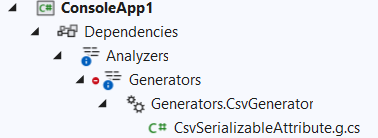

# Lab 4 - Creating a Source Generator

Source generators offer an alternative to reflection based code approaches by allowing you to generate new code based on existing code. You cannot modify existing code with a generator, but can add modules, partial classes, etc. Before you start, you may want to familiarize yourself with the [Source Generator Cookbook](https://github.com/dotnet/roslyn/blob/main/docs/features/source-generators.cookbook.md) and trying to use some of the [sample source generators](https://github.com/dotnet/roslyn-sdk/tree/main/samples/CSharp/SourceGenerators) provided by the Roslyn team.

If you prefer to just jump in, continue following along. We're going to build a tool to be able to build a CSV serializer for designated classes so that we don't need to manually build them by hand and don't need to take the performance penalty of reflection. Unlike the Analyzer and Code fix sample, we there's no dedicated template for Source Generators now, but they're pretty simple .Net Standard class libraries, so we should be able to create one quickly.

Start by Creating a new C# Class library using the .Net core template. Make sure to target .Net Standard 2.0 to allow Visual Studio to run it. Name the project `Generators`. 

Generators are based on the C# compiler services. Add the following references to your csproj file. 

```xml
	<ItemGroup>
		<PackageReference Include="Microsoft.CodeAnalysis.Analyzers" Version="3.3.2" PrivateAssets="all" />
		<PackageReference Include="Microsoft.CodeAnalysis.CSharp" Version="4.0.1" PrivateAssets="all" />
	</ItemGroup>
```

With that in place, we can start working on the actual generator implementation. Rename Class1.cs to CsvGenerator.cs and open it up.

To start, let's set up some using clauses that we're going to need at the top of the CsvGenerator.cs:
```cs
using Microsoft.CodeAnalysis;
using Microsoft.CodeAnalysis.CSharp;
using Microsoft.CodeAnalysis.CSharp.Syntax;
using Microsoft.CodeAnalysis.Text;
using System;
using System.Linq;
using System.Text;
```
Now we can set the class up to be recognized as a Source Generator by adding the `Generator` attribute and implementing the `ISourceGenerator` interface. At this point, your class should like like the following.
```cs
    [Generator]
    public class CsvGenerator : ISourceGenerator
    {
        public void Execute(GeneratorExecutionContext context)
        {
            throw new NotImplementedException();
        }

        public void Initialize(GeneratorInitializationContext context)
        {
            throw new NotImplementedException();
        }
    }
```

We don't want our serializer to work on all classes, only designated ones. For our purposes, we can create an attribute that we can add into the target solution through the generator. Since source is just string text, let's set up a constant string in our class that defines the attribute. _Be careful with these strings and the quote symbols because the code is very sensitive around these and the quotes in particular can get confusing quickly. In addition, we need to register this code as a virtual generated file. Add the registration to the `Execute` method.

```cs
        private const string csvSerializerAttributeText = @"
using System;
namespace CsvSerializer;

[AttributeUsage(AttributeTargets.Class)]
public class CsvSerializableAttribute : Attribute
{
    public CsvSerializableAttribute() {}
}";

        public void Execute(GeneratorExecutionContext context)
        {
            context.AddSource("CsvSerializableAttribute.g.cs", SourceText.From(csvSerializerAttributeText, Encoding.UTF8));
        }
```
For the moment, remove the implementation inside of the `Initialize` method.
```cs
        public void Initialize(GeneratorInitializationContext context)
        {
            
        }
```
At this point, we have a functioning code generator, not that it does much. Let's see if we can put it to use. Add another project to the solution, in this case a .Net 6 C# console application. To the console app, add a project reference to the Generators. But wait, generator references are handled a bit differently. Open the csproj file for the new console app and update the project reference specifying the `OutputItemType` and `ReferenceOutputAssembly`.
```xml
  <ItemGroup>
    <ProjectReference Include="..\Generators\Generators.csproj"  OutputItemType="Analyzer" ReferenceOutputAssembly="false"  />
  </ItemGroup>
```
Now, let's set up a `Person` class that we're going to want to serialize. Give it FirstName and LastName auto properties.
```cs
    public class Person
    {
        public string FirstName { get; set; }
        public string LastName { get; set; }
    }
```
To make this class serializable, annotate the class with the `CsvSerializable` attribute that we added above. Don't forget to add a using clause for the `CsvSerializer` namespace.
```cs
using CsvSerializer;

namespace ConsoleApp1
{
    [CsvSerializable]
    public class Person
    {
```
Word of warning. Sometimes Source Generators in Visual Studio are a challenge to debug. Visual Studio doesn't automatically refresh the generator in memory on changes. If the attribute and namespace aren't detected automatically, build the solution, close it, and re-open it. We'll look at building unit tests which are much easier to debug over time.

If all goes well, you can click on the CsvSerializable attribute and then press F12 to go-to-definition and see the code the generator injected. Notice the banner at the top of the file that states, `This file is auto-generated by the generator 'Generators.CsvGenerator' and cannot be edited.`. You cannot change this file. Another way to see the generated files is to open the analyzer for Generators in the solution explorer and expand it to see the files.


## CSV Generator implementation
Assuming you were able to add the attribute to your class, we're ready to continue implementing the real CSV serializer. This is going to take a bit to get the classes with the attributes and inspect the semantic models of those classes to find the properties that we can serialize and generate a class with extension methods for each of the annotated types.

Step 1: Let's create a class that implements ISyntaxReceiver that can parse the identified nodes to find the classes that have the CsvSerializable attribute.

```cs
using Microsoft.CodeAnalysis;
using Microsoft.CodeAnalysis.CSharp.Syntax;
using System;
using System.Collections.Generic;
using System.Text;

namespace Generators
{
    public class CsvGeneratorSyntaxReceiver : ISyntaxReceiver
    {
        public List<ClassDeclarationSyntax> AttributeClasses { get; } = new List<ClassDeclarationSyntax>();

        public void OnVisitSyntaxNode(SyntaxNode syntaxNode)
        {
            if (syntaxNode is ClassDeclarationSyntax classSyntax)
            {
                foreach (var al in classSyntax.AttributeLists)
                {
                    foreach (var attribute in al.Attributes)
                    {
                        if (attribute.Name.GetText().ToString() == "CsvSerializable")
                        {
                            AttributeClasses.Add(classSyntax);
                        }
                    }
                }
            }
        }
    }
}
```
The ISyntaxReceiver requires a single method that takes a SyntaxNode. We check if the node is a ClassDeclarationSyntax. Remember how we identified those using the Syntax Visualizer tool in lab3? We're using the same object models here as well.
From the class, we get the attribute list and iterate over it's attributes to see if the name is CsvSerializable. If so, we add that to a list of classes that we care about and can consume in our generator.

Let's Initialize our syntax generator to use the SyntaxReceiver that we just created. Add the following to the CsvGenerator's Initialize method:
```cs
context.RegisterForSyntaxNotifications(() => new CsvGeneratorSyntaxReceiver());
```
The remainder of our work will be in the Execute method which will do the work of generating the class with extension methods that will be injected. Add the following to the Execute method:
```cs
            var sb = new StringBuilder();
            // Implementation goes here

            context.AddSource("CsvSerializer.g.cs", SourceText.From(sb.ToString(), Encoding.UTF8));
```
You can try testing to see if the new file is recognized, but it will be empty at this point. Let's fill it up. First, we're going to need to access the semantic model in the solution of the class and not just work with strings. We'll set the solution up once.
```cs
            var options = (context.Compilation as CSharpCompilation).SyntaxTrees[0].Options as CSharpParseOptions;

            var attributeSyntaxTree = CSharpSyntaxTree.ParseText(SourceText.From(csvSerializerAttributeText, Encoding.UTF8), options);
            Compilation compilation = context.Compilation.AddSyntaxTrees(attributeSyntaxTree);
```

Let's start building the string for the class that will hold our extension methods.
```cs
            sb.AppendLine(@"
namespace CsvSerializer;

public static class GeneratedSerializer
{");
```
Next we iterate over the classes that the SyntaxReceiver identified and build up the extension methods for each type. One thing to call out is that these generators need to be very sensitive to memory allocations and performance. While this may look like a bit of brute force, we have to avoid things like LINQ that add some unnecessary performance overhead.
```cs
            foreach (var classDeclaration in receiver.AttributeClasses)
            {
                if (classDeclaration == null)
                {
                    continue;
                }
                SemanticModel model = compilation.GetSemanticModel(classDeclaration.SyntaxTree);
                ITypeSymbol classSymbol = model.GetDeclaredSymbol(classDeclaration);

                var classFullName = !string.IsNullOrEmpty(classSymbol.ContainingNamespace?.Name) ?
                    $"{classSymbol.ContainingNamespace.Name}.{classDeclaration.Identifier.Text}"
                    : classDeclaration.Identifier.Text;

                sb.AppendLine($@"    public static string ToCsv(this {classFullName} input) => ""{classFullName}"";");
            }
```
Finally, we need to close off the generated class.
```cs
            sb.Append(@"
}");
```
Build the solution again and see if the new file is added in the solution explorer for the console project. If not, try closing and re-opening Visual Studio to force it to refresh. If all goes well, this file should now look something like the following generated class:
```cs

namespace CsvSerializer;

public static class GeneratedSerializer
{
    public static string ToCsv(this ConsoleApp1.Person input) => "ConsoleApp1.Person";

}
```
Well, that's progress, but not quite what we want yet because it's just returning the class name and not actually serializing anything. We need to grab the properties from the class and add those property accessors to build the comma separated set of values. Update the Execute method so that it looks like this:
```cs
        public void Execute(GeneratorExecutionContext context)
        {
            context.AddSource("CsvSerializableAttribute.g.cs", SourceText.From(csvSerializerAttributeText, Encoding.UTF8));

            if (!(context.SyntaxReceiver is CsvGeneratorSyntaxReceiver receiver))
            {
                return;
            }

            var options = (context.Compilation as CSharpCompilation).SyntaxTrees[0].Options as CSharpParseOptions;

            var attributeSyntaxTree = CSharpSyntaxTree.ParseText(SourceText.From(csvSerializerAttributeText, Encoding.UTF8), options);
            Compilation compilation = context.Compilation.AddSyntaxTrees(attributeSyntaxTree);

            var sb = new StringBuilder();
            // Initialize class
            sb.Append(@"
using System.Linq;
namespace CsvSerializer;

public static class GeneratedSerializer
{");

            foreach (var classDeclaration in receiver.AttributeClasses)
            {
                if (classDeclaration == null)
                {
                    continue;
                }
                SemanticModel model = compilation.GetSemanticModel(classDeclaration.SyntaxTree);
                ITypeSymbol classSymbol = model.GetDeclaredSymbol(classDeclaration);

                var classFullName = !string.IsNullOrEmpty(classSymbol.ContainingNamespace?.Name) ?
                    $"{classSymbol.ContainingNamespace.Name}.{classDeclaration.Identifier.Text}"
                    : classDeclaration.Identifier.Text;

                sb.Append($@"
    public static string ToCsv(this {classFullName} input) =>
        $""");

                var propertyCount = 0;
                foreach (var propertyDeclaration in classDeclaration.Members.OfType<PropertyDeclarationSyntax>())
                {
                    if (propertyCount > 0)
                    {
                        sb.Append(", ");
                    }
                    IPropertySymbol propertySymbol = model.GetDeclaredSymbol(propertyDeclaration);

                    sb.Append($"{{input.{propertyDeclaration.Identifier.Text}}}");
                    propertyCount++;
                }
                sb.Append(@""";
");

            }
            // Close class
            sb.Append(@"
}");
            context.AddSource("CsvSerializer.g.cs", SourceText.From(sb.ToString(), Encoding.UTF8));
        }
```
Here we are getting the PropertyDeclarationSyntax from the ClassDeclaration.Members and adding in the property's Identifier text value. Build, (restart VS) and check the generated class again and we should now see this.

```cs
using System.Linq;
namespace CsvSerializer;

public static class GeneratedSerializer
{
    public static string ToCsv(this ConsoleApp1.Person input) =>
        $"{input.FirstName}, {input.LastName}";

}
```
If we return to the program.cs in the console app, we can test out our implementation.
```cs
using ConsoleApp1;
using CsvSerializer;

Console.WriteLine(new Person { FirstName = "John", LastName = "Doe" }.ToCsv());
```

Running the console app, we should see the following output:
```
John, Doe
```

## Unit testing
If you're tired of closing and restarting Visual Studio or want a good way of trying to step through debug your generator, now's a good time to start building out some unit tests for your solution. They make debugging and iteratively testing a lot easier. The process of writing tests is very similar to what you used in lab 3 for writing tests on code fixes where you assert the input code as string generates expected output as string. Luckily Microsoft supplies a library dedicated to unit testing source generators. Add a new XUnit test project to your solution and name it `GeneratorTests`. In the project file, add the following references:
```cs
	  <PackageReference Include="Microsoft.CodeAnalysis" Version="4.0.0.0" />
    <PackageReference Include="Microsoft.CodeAnalysis.CSharp.SourceGenerators.Testing.XUnit" Version="1.1.1" />
    <PackageReference Include="Microsoft.NET.Test.Sdk" Version="17.1.0" />
    <PackageReference Include="xunit" Version="2.4.1" />
    <PackageReference Include="xunit.runner.visualstudio" Version="2.4.3">
      <IncludeAssets>runtime; build; native; contentfiles; analyzers; buildtransitive</IncludeAssets>
      <PrivateAssets>all</PrivateAssets>
    </PackageReference>
    <PackageReference Include="coverlet.collector" Version="3.1.2">
      <IncludeAssets>runtime; build; native; contentfiles; analyzers; buildtransitive</IncludeAssets>
      <PrivateAssets>all</PrivateAssets>
    </PackageReference>
```
Additionally, add a normal project reference to your Generator library. This can just be a normal reference. We won't be using it to actually generate dynamic code in our test class, so we don't need the additional attributes that we would if we were consuming this as a source generator.

To make things easier on your testing process, add one more helper class to the project. This will help setup the compilation process that will execute our generator in the tests.

```cs
using Microsoft.CodeAnalysis;
using Microsoft.CodeAnalysis.CSharp;
using Microsoft.CodeAnalysis.CSharp.Testing;
using Microsoft.CodeAnalysis.Testing.Verifiers;
using System;
using System.Collections.Immutable;

namespace GeneratorTests;

public static class CSharpSourceGeneratorVerifier<TSourceGenerator>
    where TSourceGenerator : ISourceGenerator, new()
{
    public class Test : CSharpSourceGeneratorTest<TSourceGenerator, XUnitVerifier>
    {
        public Test()
        {
        }

        protected override CompilationOptions CreateCompilationOptions()
        {
            var compilationOptions = base.CreateCompilationOptions();
            return compilationOptions.WithSpecificDiagnosticOptions(
                 compilationOptions.SpecificDiagnosticOptions.SetItems(GetNullableWarningsFromCompiler()));
        }

        public LanguageVersion LanguageVersion { get; set; } = LanguageVersion.Default;

        private static ImmutableDictionary<string, ReportDiagnostic> GetNullableWarningsFromCompiler()
        {
            string[] args = { "/warnaserror:nullable" };
            var commandLineArguments = CSharpCommandLineParser.Default.Parse(args, baseDirectory: Environment.CurrentDirectory, sdkDirectory: Environment.CurrentDirectory);
            var nullableWarnings = commandLineArguments.CompilationOptions.SpecificDiagnosticOptions;

            return nullableWarnings;
        }

        protected override ParseOptions CreateParseOptions()
        {
            return ((CSharpParseOptions)base.CreateParseOptions()).WithLanguageVersion(LanguageVersion);
        }
    }
}
```

Now we're ready to jump into writing a test case. There's quite a bit of code here, but essentially we set the `source` string for the class that we want to send into the generator to evaluate and an `expected` string of what the generator should output. With that, we can use the helper `Test` method declared above to run the assertions. Replace your UnitTest1 class implementation with the following:

```cs
using Generators;
using Microsoft.CodeAnalysis.Text;
using System.Text;
using VerifyCS = GeneratorTests.CSharpSourceGeneratorVerifier<Generators.CsvGenerator>;

namespace GeneratorTests
{
    public class UnitTest1
    {
        private const string  generatedAttribute = @"
using System;
namespace CsvSerializer;

[AttributeUsage(AttributeTargets.Class)]
public class CsvSerializableAttribute : Attribute
{
    public CsvSerializableAttribute() {}
}";

        [Fact]
        public async Task TestCsvGeneratorAsync()
        {
            var input = @"
using CsvSerializer;

[CsvSerializable]
public class Person
{
    public string Name { get; set; }
    public int Age { get; set; }
}
";

            var generated = @"
using System.Linq;
namespace CsvSerializer;

public static class GeneratedSerializer
{
    public static string ToCsv(this Person input) =>
        $""{input.Name}, {input.Age}"";

}";

            await new VerifyCS.Test
            {
                TestState =
                {
                    Sources = {input},
                    GeneratedSources =
                    {
                        (typeof(CsvGenerator), "CsvSerializableAttribute.g.cs", SourceText.From(generatedAttribute, Encoding.UTF8)),
                        (typeof(CsvGenerator), "CsvSerializer.g.cs", SourceText.From(generated, Encoding.UTF8))
                    }
                }
            }.RunAsync();
        }

        [Fact]
        public async Task CsvGenerator_WhenMultipleClasses_GeneratesInSeparateRegions()
        {
            // The source code to test
            var source = @"
using CsvSerializer;

[CsvSerializable]
public class Person
{
    public string Name { get; set; }
    public int Age { get; set; }
}

public class NotSerialized
{
    public string A {get; set; }
}

[CsvSerializable]
public class Works
{
    public string Col1 {get; set;}
}
";

            var expected = @"
using System.Linq;
namespace CsvSerializer;

public static class GeneratedSerializer
{
    #region Person
    public static string ToCsv(this Person input) =>
        $""\""{input.Name}\"", {input.Age}"";

    public static string ToCsvHeader(this Person input) =>
        ""Name, Age"";

    public static string ToCsv(this System.Collections.Generic.IEnumerable<Person> input)
    {
        var sb = new System.Text.StringBuilder();
        if (input.Any())
        {
            sb.AppendLine(input.First().ToCsvHeader());
            foreach (var item in input)
            {
                sb.AppendLine(item.ToCsv());
            }
        }
        return sb.ToString();
    }

    #endregion

    #region Works
    public static string ToCsv(this Works input) =>
        $""\""{input.Col1}\"""";

    public static string ToCsvHeader(this Works input) =>
        ""Col1"";

    public static string ToCsv(this System.Collections.Generic.IEnumerable<Works> input)
    {
        var sb = new System.Text.StringBuilder();
        if (input.Any())
        {
            sb.AppendLine(input.First().ToCsvHeader());
            foreach (var item in input)
            {
                sb.AppendLine(item.ToCsv());
            }
        }
        return sb.ToString();
    }

    #endregion

}";

            // Pass the source code to our helper and snapshot test the output
            await new VerifyCS.Test
            {
                TestState =
                {
                    Sources = {source},
                    GeneratedSources =
                    {
                        (typeof(CsvGenerator), "CsvSerializableAttribute.g.cs", SourceText.From(generatedAttribute, Encoding.UTF8)),
                        (typeof(CsvGenerator), "CsvSerializer.g.cs", SourceText.From(expected, Encoding.UTF8))
                    }
                }
            }.RunAsync();
        }
    }
}
```

Run the test and make sure it passes. If not, check the diff to compare the expected verses actual to see if you can identify the differences. Remember that this is very sensitive to not only the text code, but also the number of spaces, quotes and other "trivia". Assuming this test passes, try creating some additional test cases like testing Fields, additional data types, etc.

## On your own
To see how well you understand what you've done, see if you can add some more extensions to the generator to flesh out the implementation. Remember that if you've built the unit tests, you will likely need to update them whenever you change the implementation to reflect the new changes. Here are some suggested enhancements that you should be able to make with the semantic models you already are working with.

- Add support for injecting a header row with the property names in the generated csv file.
- Support string escaping by determining if the property is a string and if so, surrounding the output value with strings to handle cases where the property's value could contain a comma.
- Add support for sending in an IEnumerable<T> and iterating over the results including the header row and subsequent text lines for each item in the list.

If you get stuck, check out the sample implementation in the Lab4-End for a reference implementation.